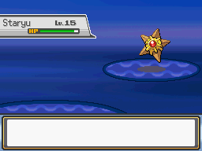
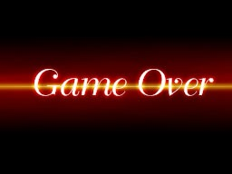

# Game Over
This script is for Pokémon Essentials. When a switch is on, its activates a game over when the player lose a battle instead of going to last healing spot.

## Screens

## Compatibility
Doesn't work on Essentials versions older than v19. To see other script versions, look at [all branches](../../branches/all).

## Installation
- Follow FL's [Essentials plugin installation instructions](https://github.com/FL-/Misc/tree/main/Guides/EssentialsInstallPlugin).
- On RPG Maker XP system database (F9), define Game Over ME and the graphic. Please note that Essentials uses a different screen size (the default is 512x384), so the game over graphic must match.
- On Plugins/Game Over/Script.rb , change the switch on GAMEOVERSWITCH to your selected switch number. The Game Over will happen when this switch is ON.